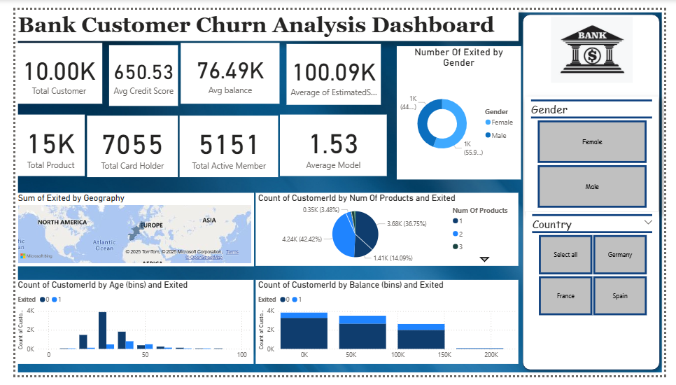

# 📊 Bank Customer Churn Analysis Dashboard

This project visualizes key metrics related to customer churn using Power BI. The dashboard helps stakeholders understand churn trends, customer demographics, and product engagement.

## 🔍 Overview

**Objective:** Analyze factors leading to customer churn and identify patterns to improve customer retention.

**Key Metrics Visualized:**
- Total customers, credit scores, balances, salaries
- Churn by gender, geography, age, balance bins, and number of products
- Active members vs card holders
- Interactive slicers by gender and country

## 📁 Files Included

- `BankCustomerChurnDashboard.pbix` – Main Power BI file
- `Churn_Modelling.csv` – Sample raw dataset used
- `Screenshot.png` – Dashboard preview
- `README.md` – Project documentation

## 🚀 Features

- Interactive slicers (Gender, Country)
- KPI cards for quick summary
- Geo map for churn by region
- Bar and pie charts for multivariate breakdowns

---

## 🛠 Tools Used

- **Power BI Desktop**
- **Data Source:** CSV file with customer churn data
- **Visuals:** Card KPIs, Pie Charts, Maps, Bar Graphs, Slicers

---

## 📌 How to Use

1. Download the `.pbix` file
2. Open with Power BI Desktop
3. Modify filters or explore additional visuals

---

## 🧠 Insights

- Higher churn observed in customers with fewer products
- Gender and geography show minor differences in churn trends
- Salary and balance bins impact churn likelihood

---

## 📞 Contact

**Your Name** – [LinkedIn](https://linkedin.com/in/sakirmansuri) | [Email](mailto:sakir.mansuri2103@gmail.com)
